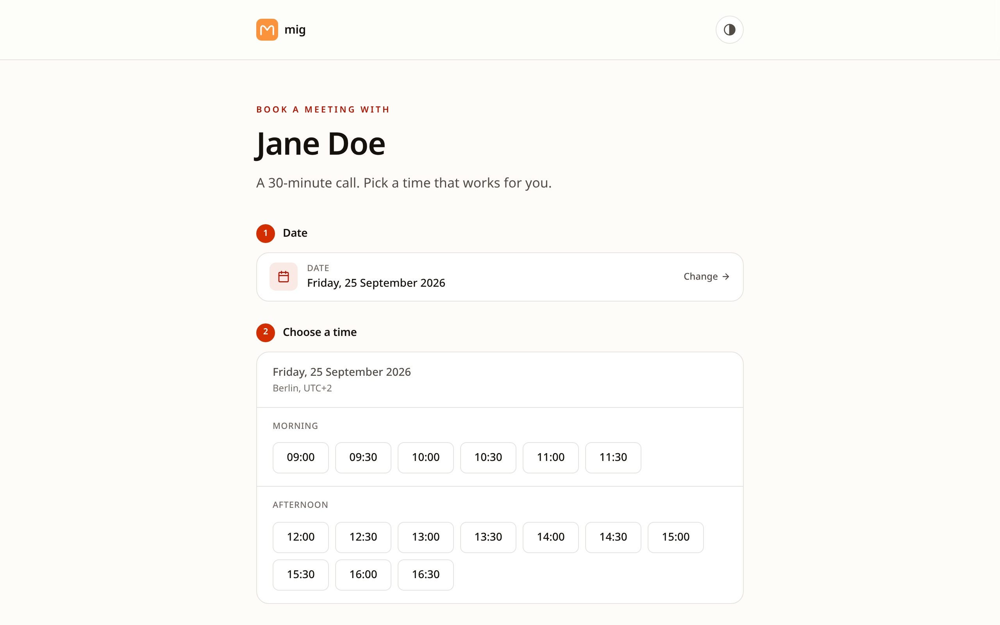
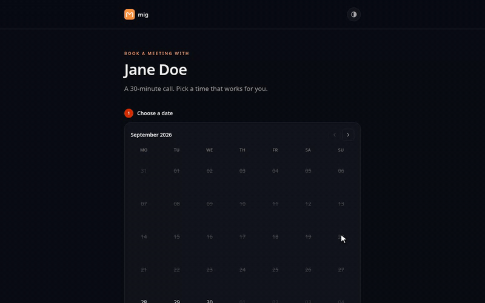
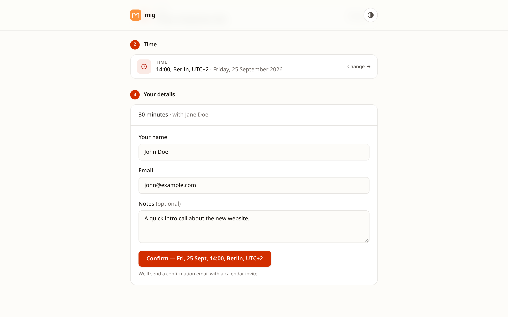
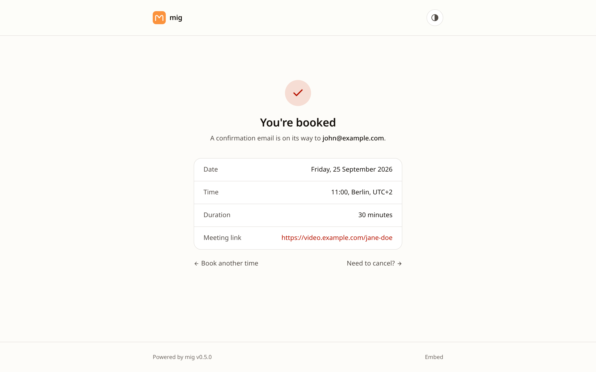
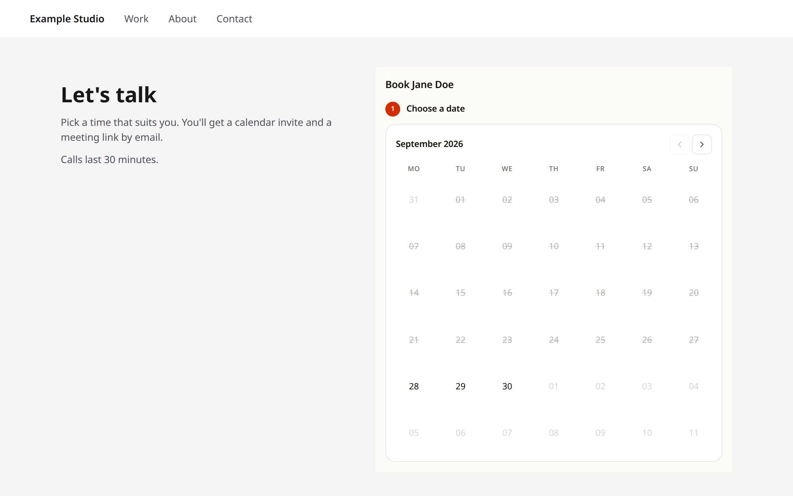

# mig ⏱

[](https://ci.antonshubin.com/repos/12)
[](https://hub.docker.com/r/antonshubin/mig)
[](https://deno.land)
[](LICENSE)
[](https://github.com/spy4x/mig)

<picture>
  <source media="(prefers-color-scheme: dark)" srcset="docs/screenshots/booking-time-dark.png">
  
</picture>

```bash
docker run -d -p 8080:8080 -v ./data:/data --env-file .env antonshubin/mig:latest
```

Fill `.env` from [`.env.example`](.env.example) first;
[Quick start](#quick-start) has the full command and the data directory's
permissions.

**mig** (миг — Russian for "moment") is a tiny self-hosted meeting scheduler.
One owner, one URL, one feature: book a time slot. It is a modern web app built
on web standards — Fetch, Web Crypto, Streams and ES modules — and runs on Deno
in a small Docker image.

```
┌──────────┐    ┌──────────┐    ┌──────────┐
│ Visitor  │───▶│   mig    │───▶│  Owner   │
│ (anyone) │    │ (single) │    │  (you)   │
└──────────┘    └──────────┘    └──────────┘
                     │
                     ▼
              ┌─────────────┐
              │ JSON file + │
              │ SMTP + ICS  │
              └─────────────┘
```

## Why mig?

Calendly alternatives are heavyweight (cal.com = Next.js + Postgres + Redis,
CloudMeet = Cloudflare + D1 + OAuth). Mig is one small process that reads its
config from env vars and stores bookings in a JSON file. No DB, no OAuth, no
admin UI.

**Use it if:**

- You want to put a "book a meeting with me" link on your personal site
- You don't need round-robin, payments, multiple event types, or teams
- You enjoy owning your data in a file you can `cat`

**Don't use it if:**

- You need a team scheduler, payments, or calendar sync
- You need to scale to thousands of bookings per day

## See it



| Confirm step                                                                                                                                                                                                        | Confirmation page                                                                                                                               |
| ------------------------------------------------------------------------------------------------------------------------------------------------------------------------------------------------------------------- | ----------------------------------------------------------------------------------------------------------------------------------------------- |
|  |  |


_The confirmation email the guest receives, with the `.ics` invite attached._

Dark-theme versions of the app pictures are in
[`docs/screenshots/`](docs/screenshots/). `deno task screenshots` regenerates
them all from placeholder data.

## Features

- **One owner, one URL.** No accounts, no login. Owner defined via `HOST_NAME` +
  `HOST_EMAIL` env vars.
- **IaaC.** Working hours, blocked dates, slot duration, meeting URL, SMTP
  credentials — all env vars. No admin UI to configure.
- **JSON storage + atomic write.** Bookings live in `data/bookings.json`,
  written via temp-file-then-rename. Single process; in-memory mutex serialises
  writes.
- **Static meeting link.** One `MEETING_URL` (Google Meet, Miratalk, Whereby,
  etc.) embedded in every confirmation email.
- **ICS attachment.** Every confirmation includes a `.ics` file so the guest can
  add the meeting to their calendar in one click.
- **Cancellation by link.** Both owner and guest get a cancellable link in their
  email. SHA-256 HMAC of a random token; stateless.
- **Two clocks, everywhere.** The visitor sees times in their own zone — city
  and UTC offset shown once above the slot list (e.g. `New York, UTC-4`) so each
  slot itself just reads `11:00`, and next to every other single time, with its
  date converted alongside it — on the confirm step, confirmation page and
  cancel page, and in every email they receive. The owner sees the same for the
  host zone, plus the visitor's clock (and date, when it differs) alongside it
  in the owner's booking/cancellation emails and the NTFY push, so they always
  know both the time and where the visitor is. Guest zone is auto-detected in
  the browser; without JavaScript, times fall back to the host's zone, labelled
  as such.
- **Iframe-ready.** `/embed` strips chrome for use inside another page, and
  every step of the booking flow — date, time, confirm, the confirmation page —
  stays under `/embed`. See [Embedding](#embedding).
- **Dark + light theme.** Tailwind v4, follows OS preference, toggle persists in
  localStorage.
- **Modern stack.** Fresh 2 (Preact + JSX), Tailwind v4, single binary via
  `deno compile`.

## Quick start

### Docker

```bash
docker run -d --name mig \
  -p 8080:8080 \
  -v ./data:/data:z \
  -e HOST_NAME="Jane Doe" \
  -e HOST_EMAIL="jane@example.com" \
  -e HOST_TZ="Europe/Berlin" \
  -e MEETING_URL="https://meet.google.com/abc-defg-hij" \
  -e WEEKLY_AVAILABILITY="MON-FRI 09:00-17:00" \
  -e SLOT_DURATION_MIN=30 \
  -e MIN_NOTICE_HOURS=6 \
  -e SMTP_HOST=smtp.example.com \
  -e SMTP_PORT=587 \
  -e SMTP_USER=jane@example.com \
  -e SMTP_PASSWORD='change-me' \
  -e SMTP_FROM="Bookings <book@example.com>" \
  -e CANCEL_SECRET=$(openssl rand -base64 32) \
  -e PUBLIC_URL=https://meet.example.com \
  antonshubin/mig:latest
```

The container runs as `deno`, uid/gid 1993 — not root. `./data` must be writable
by that uid. Create it yourself first — `docker run` would otherwise create a
missing bind-mount source owned by root, which neither the default user nor
`--user` below could write to — then make it writable:

```bash
mkdir -p ./data
sudo chown 1993:1993 ./data
```

`chown`ing to a different uid needs root, hence `sudo`; a plain `chown` as your
own user fails with "Operation not permitted". If you'd rather not use `sudo`
(on regular, rootful Docker), run the container as your own user instead — this
works because you created `./data` yourself above, so you already own it:

```bash
mkdir -p ./data
docker run --user "$(id -u):$(id -g)" ...
```

The `chown 1993:1993` step also assumes rootful Docker — rootless Podman remaps
container uids to a different host range, so `chown 1993:1993` is meaningless
there, and plain `--user` alone fails with "Permission denied". On rootless
Podman, add `--userns=keep-id` too:

```bash
mkdir -p ./data
podman run --userns=keep-id --user "$(id -u):$(id -g)" ...
```

A **new, empty** Docker named volume (`-v mig-data:/data` instead of a host
path) needs neither step — Docker creates it owned by `deno` already, since
`/data` inside the image is. A named volume already used by mig before this
change is still owned by root; see the CHANGELOG's 0.4.0 upgrade note for the
fix.

The `:z` on the bind mount above relabels `./data` for SELinux (Fedora, RHEL and
derivatives) so the container is allowed to read and write it at all — without
it, a host with SELinux enforcing rejects the access with the same "Permission
denied" the uid mismatch above produces, even once the uid/gid ownership is
correct. It's a no-op, and safe to leave in, on a host that doesn't run SELinux.
`:z` relabels the _entire_ directory for container access, so only use it on a
folder that belongs to mig alone — never a home directory, `/srv`, or `/etc`.

### Docker Compose

```yaml
services:
  mig:
    image: antonshubin/mig:latest
    container_name: mig
    restart: unless-stopped
    ports:
      - "8080:8080"
    volumes:
      - ./data:/data:z
    environment:
      HOST_NAME: "Jane Doe"
      HOST_EMAIL: "jane@example.com"
      HOST_TZ: "Europe/Berlin"
      MEETING_URL: "https://meet.google.com/abc-defg-hij"
      WEEKLY_AVAILABILITY: "MON-FRI 09:00-17:00"
      SLOT_DURATION_MIN: "30"
      MIN_NOTICE_HOURS: "6"
      SMTP_HOST: "smtp.example.com"
      SMTP_PORT: "587"
      SMTP_USER: "jane@example.com"
      SMTP_PASSWORD: "change-me"
      SMTP_FROM: "Bookings <book@example.com>"
      CANCEL_SECRET: "change-me" # replace with the output of: openssl rand -base64 32
      PUBLIC_URL: "https://meet.example.com"
```

`./data` needs the same non-root fix as the Docker quick start above: create it
first (`mkdir -p ./data`), then `sudo chown 1993:1993 ./data`, or add a
`user: "1000:1000"` — your own uid/gid — line to the service instead (only works
if you created `./data` yourself first, same as above).

See `.env.example` for the full list of env vars.

## Configuration

| Env var                | Required | Default | Description                                                                                                                                                         |
| ---------------------- | -------- | ------- | ------------------------------------------------------------------------------------------------------------------------------------------------------------------- |
| `HOST_NAME`            | yes      | —       | Owner's display name                                                                                                                                                |
| `HOST_EMAIL`           | yes      | —       | Owner's email (receives booking + cancel notifications)                                                                                                             |
| `HOST_TZ`              | yes      | —       | IANA timezone, e.g. `Europe/Berlin`                                                                                                                                 |
| `MEETING_URL`          | yes      | —       | Static meeting URL embedded in every confirmation                                                                                                                   |
| `WEEKLY_AVAILABILITY`  | yes      | —       | Comma-separated `DAY HH:MM-HH:MM` list, e.g. `MON-FRI 09:00-17:00` (see below)                                                                                      |
| `SLOT_DURATION_MIN`    | yes      | —       | Slot length in minutes (e.g. 30)                                                                                                                                    |
| `CANCEL_SECRET`        | yes      | —       | Random 32+ byte secret for HMAC sign/verify                                                                                                                         |
| `SMTP_HOST`            | yes      | —       | SMTP server hostname                                                                                                                                                |
| `SMTP_PORT`            | yes      | `587`   | SMTP port                                                                                                                                                           |
| `SMTP_USER`            | yes      | —       | SMTP username                                                                                                                                                       |
| `SMTP_PASSWORD`        | yes      | —       | SMTP password. Wrap in single quotes if it contains shell-special characters.                                                                                       |
| `SMTP_FROM`            | yes      | —       | From address (`Name <addr@example.com>`)                                                                                                                            |
| `PUBLIC_URL`           | yes      | —       | Absolute URL where mig is reachable (for links in emails)                                                                                                           |
| `MIN_NOTICE_HOURS`     | no       | `6`     | Minimum hours from now until first bookable slot                                                                                                                    |
| `BOOKING_HORIZON_DAYS` | no       | `14`    | Maximum days ahead bookable                                                                                                                                         |
| `BLOCKED_DATES`        | no       | —       | Blocked dates, see syntax below                                                                                                                                     |
| `RATE_LIMIT_PER_5MIN`  | no       | `1`     | Max bookings per IP per 5 minutes                                                                                                                                   |
| `THEME`                | no       | `auto`  | Default theme for a visitor who hasn't picked one with the toggle: `light`, `dark`, or `auto` (follow OS). `/embed` uses it unless `?theme=` is given               |
| `PORT`                 | no       | `8080`  | HTTP listen port                                                                                                                                                    |
| `HIDE_BRANDING`        | no       | `false` | `true`/`1`/`yes` hides the "Powered by mig" footer + GitHub link; `false`/`0`/`no`/empty/absent shows it. Case-insensitive, trimmed. Any other value stops startup. |
| `GITHUB_URL`           | no       | (see)   | Override the URL the footer links to. Defaults to `https://github.com/spy4x/mig`                                                                                    |
| `NTFY_URL`             | no       | —       | NTFY server base URL (e.g. `https://ntfy.example.com`). All four NTFY vars must be set to enable.                                                                   |
| `NTFY_TOPIC`           | no       | —       | NTFY topic to publish to.                                                                                                                                           |
| `NTFY_TOKEN`           | no       | —       | NTFY bearer token.                                                                                                                                                  |
| `NTFY_MODE`            | no       | `all`   | Which events push: `all`, `errors`, `booking`, or `cancel`.                                                                                                         |

### `WEEKLY_AVAILABILITY` syntax

Each entry: `DAY HH:MM-HH:MM`. `DAY` is
`MON`/`TUE`/`WED`/`THU`/`FRI`/`SAT`/`SUN`. A range `MON-FRI` expands to all
weekdays. Multiple ranges comma-separated.

```
MON-FRI 09:00-17:00          # weekdays, 9-17
MON-FRI 09:00-12:00,MON-FRI 14:00-18:00  # split with lunch
MON-THU 10:00-20:00,FRI 09:00-15:00      # different hours per day
```

### `BLOCKED_DATES` syntax

Single dates or ranges. Both `DD.MM.YYYY` and `YYYY-MM-DD` accepted. Inclusive
on both ends. Comma-separated, whitespace tolerant.

```
2026-12-24,2026-12-25,2026-12-26          # three single dates
01.01.2027-10.01.2027                    # a date range
01.01.2027-10.01.2027,04.07.2027        # range + single
```

## Embedding

<picture>
  <source media="(prefers-color-scheme: dark)" srcset="docs/screenshots/embed-dark.png">
  
</picture>

_The `/embed` variant — the same flow, stripped of header/footer chrome for
framing, here with `?theme=` matching the host page._

Drop the booking flow into another page with an iframe:

```html
<iframe
  id="mig-embed"
  src="https://meet.example.com/embed?theme=dark"
  style="width:100%;max-width:36rem;border:0"
  title="Book a meeting"
></iframe>
```

Every step a visitor can reach from `/embed` — picking a date, picking a time,
the confirm form, the confirmation page at `/embed/confirmed` — stays under the
`/embed` path prefix. The only exceptions are the meeting link and the cancel
link on the confirmation page, which open in a new tab, because they point at
pages (`MEETING_URL`, `/cancel`) that live outside `/embed`. That means the host
embedding mig only needs to allow framing for `/embed`, not the whole site.

Concretely, on the host serving mig behind a reverse proxy, apply this to paths
starting with `/embed` only:

```
Content-Security-Policy: frame-ancestors https://your-site.example
```

That header is the actual requirement. Current browsers (Chromium, Firefox,
WebKit) follow `frame-ancestors` and ignore `X-Frame-Options` whenever both are
present on the same response — the CSP Level 2 spec calls for exactly that — so
an `X-Frame-Options: DENY` or `SAMEORIGIN` a reverse proxy sets globally can
stay; it won't block the frame as long as `frame-ancestors` is also there on
`/embed`. Only a browser old enough to lack CSP Level 2 support would still
honor `X-Frame-Options` and refuse the frame. The rest of the site (`/`,
`/confirmed`, `/cancel`) can keep denying framing entirely.

### Theme

An iframe's `prefers-color-scheme` follows the _visitor's_ OS, not the page
embedding it — so `/embed` rendering light on a dark host site isn't a bug the
visitor's system settings can fix; the frame genuinely can't see the host page's
theme on its own. Tell it explicitly with `?theme=`:

- `?theme=dark` / `?theme=light` — force that theme inside the embed, regardless
  of the visitor's OS or anything stored in `localStorage`.
- `?theme=auto` (the default — same as omitting the param entirely) — the
  owner's `THEME` setting when it is `light` or `dark`; with `THEME=auto`, the
  stored preference (shared with the standalone site, since both live on the
  same origin), then `prefers-color-scheme`.

Any other value falls back to `auto` rather than erroring. Once forced, the
theme survives the whole flow — every link (date, time, change), the confirm
form's submission, and every redirect it can land on (success, validation error,
conflict, rate limit) — so `/embed/confirmed` renders in the same theme the
visitor picked a time in. An explicit `?theme=` never touches the standalone
site's `mig-theme` `localStorage` key: it only ever overrides what that key
would otherwise decide, for this one embed.

### Auto-resizing

Every page `/embed` itself renders — the date/time/confirm steps, a validation
error or rate limit on any of those, and every state of `/embed/confirmed`
(booked, cancelled, or a stale/invalid link) — posts its content height to the
parent on load and again whenever it changes, growing or shrinking to match:

```js
{ type: "mig:height", height: 612 } // height in CSS pixels
```

An unmatched path under `/embed` (a typo, or a link to a route that no longer
exists) falls through to mig's site-wide 404 page instead, which is not part of
the embed family — it renders the standalone site's header and footer — so it
carries no height script; a host framing only `/embed` shouldn't be able to
reach it in the first place.

Listen for it and size the iframe to match, so nothing is ever cut off at a
fixed height with an inner scrollbar:

```html
<script>
const iframe = document.getElementById("mig-embed");
window.addEventListener("message", (event) => {
  if (event.origin !== "https://meet.example.com") return;
  if (event.source !== iframe.contentWindow) return;
  if (event.data?.type !== "mig:height") return;
  iframe.style.height = `${event.data.height}px`;
});
</script>
```

Checking both `event.origin` (against mig's own origin) and `event.source`
(against the specific iframe's `contentWindow`) means a message from any other
frame or origin on the page is ignored, even one also named `"mig:height"`. The
message itself carries only a content height in CSS pixels — no booking details,
no visitor data — so mig posts it with target origin `"*"`; there's nothing in
it a different origin reading it could misuse.

### Timezone

`/embed` detects the visitor's timezone with a small inline script (no tracking,
nothing sent anywhere) on every page load, and carries it forward as a `?tz=`
query param on every link in the flow — so the slot list itself renders in the
visitor's zone, not just the confirmation email. The script re-checks the zone
on every load and redirects again only if it no longer matches the browser's own
zone (a link shared with someone else's `?tz=` already in it gets fixed on their
first visit). A zone already spelled the way the browser's own curated IANA list
has it is kept exactly as sent. Wrong casing is fixed two ways: first against
that curated list (`america/new_york` → `America/New_York`), then, for a name
the list omits entirely — most `Etc/*` zones, and a few modern names some
engines expose only through their legacy alias, such as `Asia/Ho_Chi_Minh` —
against the browser's own zone resolution, but only when that resolution is the
very same name in different casing (`etc/gmt+5` → `Etc/GMT+5`); when it would
resolve to a different, legacy name instead (`asia/ho_chi_minh` would resolve to
`Asia/Saigon`), the casing is left exactly as sent rather than renamed. An
`Etc/*` zone always renders as an offset, never a city, whatever its case. A
name with no slash (`Japan`, `EST5EDT`) is resolved to its full zone. None of
this ever rewrites a valid zone to a different (e.g. legacy) spelling, so a
browser that keeps reporting the same zone settles after one redirect. A query
param was chosen over a cookie so `/embed` stays stateless and works even where
an iframe's third-party cookies are blocked. Without JavaScript that param is
never set and the booking still goes through; the slot list, confirm step,
confirmation page and cancel page (on both `/embed` and the standalone site)
then show the host's time instead, labelled "Times are shown in the host's
timezone."

## Architecture

Single-process Deno app. JSON file + atomic rename is the only persistence. SMTP
is the only network dependency at runtime.

```
Request → Fresh route → lib/* (pure) → bookings.mutate() (mutex)
                                            ↓
                                  JSON file (atomic write)
                                            ↓
                                  nodemailer → SMTP → owner + guest
```

Mutations are serialised by an `AsyncMutex`. Reads are lock-free (memoised in
memory; reloaded from disk on cold start and after every mutation).

## Compile (standalone binary)

```bash
deno task compile
./mig
```

The binary is ~80 MB stripped and has zero runtime dependencies.

## License

Copyright (C) 2026 Anton Shubin

Licensed under [AGPL-3.0](LICENSE). Contribution terms are in
[CONTRIBUTING.md](CONTRIBUTING.md).

---

Made by Anton Shubin · [antonshubin.com](https://antonshubin.com)
