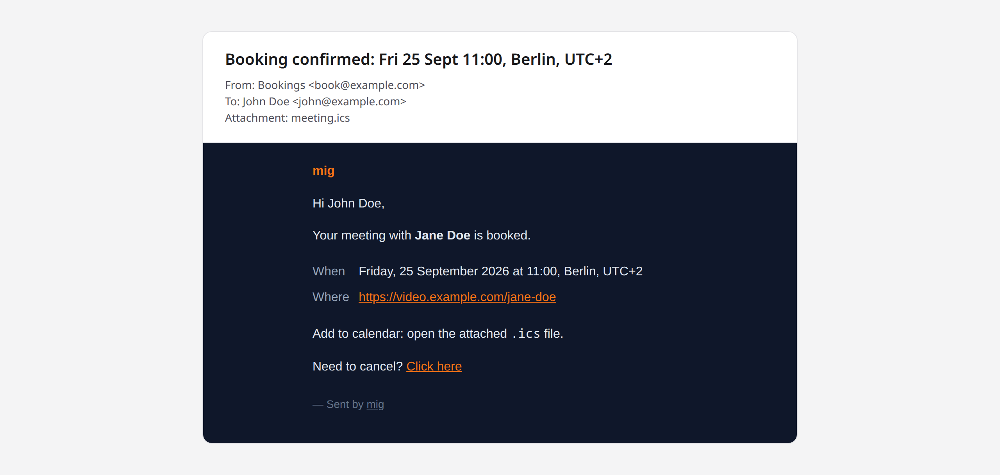

# How mig works

What mig does in detail, and how it stores bookings. For setup, see
[self-hosting.md](self-hosting.md).

## Why mig exists

Calendly alternatives are heavyweight (cal.com = Next.js + Postgres + Redis,
CloudMeet = Cloudflare + D1 + OAuth). Mig is one small process that reads its
config from env vars and stores bookings in a JSON file. No DB, no OAuth, no
admin UI.

**Use it if:**

- You want to put a "book a meeting with me" link on your personal site
- You don't need round-robin, payments, multiple event types, or teams
- You enjoy owning your data in a file you can `cat`

**Don't use it if:**

- You need a team scheduler, payments, or calendar sync
- You need to scale to thousands of bookings per day

## Features

- **One owner, one URL.** No accounts, no login. Owner defined via `HOST_NAME` +
  `HOST_EMAIL` env vars.
- **IaaC.** Working hours, blocked dates, slot duration, meeting URL, SMTP
  credentials — all env vars. No admin UI to configure.
- **JSON storage + atomic write.** Bookings live in `data/bookings.json`,
  written via temp-file-then-rename. Single process; in-memory mutex serialises
  writes.
- **Static meeting link.** One `MEETING_URL` (Google Meet, Miratalk, Whereby,
  etc.) embedded in every confirmation email.
- **ICS attachment.** Every confirmation includes a `.ics` file so the guest can
  add the meeting to their calendar in one click.
- **Cancellation by link.** Both owner and guest get a cancellable link in their
  email. SHA-256 HMAC of a random token; stateless.
- **Two clocks, everywhere.** The visitor sees times in their own zone — city
  and UTC offset shown once above the slot list (e.g. `New York, UTC-4`) so each
  slot itself just reads `11:00`, and next to every other single time, with its
  date converted alongside it — on the confirm step, confirmation page and
  cancel page, and in every email they receive. The owner sees the same for the
  host zone, plus the visitor's clock (and date, when it differs) alongside it
  in the owner's booking/cancellation emails and the NTFY push, so they always
  know both the time and where the visitor is. Guest zone is auto-detected in
  the browser; without JavaScript, times fall back to the host's zone, labelled
  as such.
- **Iframe-ready.** `/embed` strips chrome for use inside another page, and
  every step of the booking flow — date, time, confirm, the confirmation page —
  stays under `/embed`. See [Embedding](embedding.md).
- **Dark + light theme.** Tailwind v4, follows OS preference, toggle persists in
  localStorage.
- **Modern stack.** Fresh 2 (Preact + JSX), Tailwind v4, single binary via
  `deno compile`.

## Confirmation email


_The confirmation email the guest receives, with the `.ics` invite attached._

`deno task screenshots` regenerates the demo video and this picture from
placeholder data.

## Architecture

Single-process Deno app. JSON file + atomic rename is the only persistence. SMTP
is the only network dependency at runtime.

```
Request → Fresh route → lib/* (pure) → bookings.mutate() (mutex)
                                            ↓
                                  JSON file (atomic write)
                                            ↓
                                  @spy4x/email → SMTP → owner + guest
```

Mutations are serialised by an `AsyncMutex`. Reads are lock-free (memoised in
memory; reloaded from disk on cold start and after every mutation).
